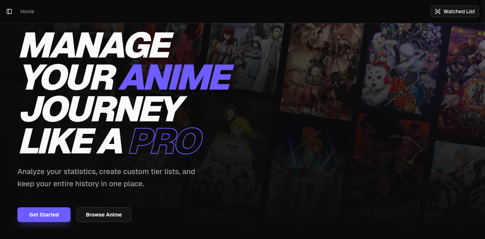
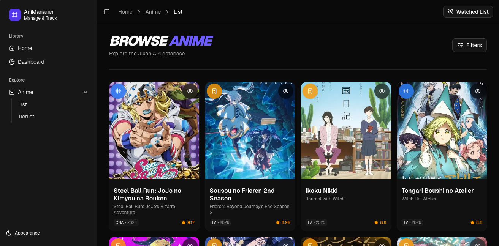
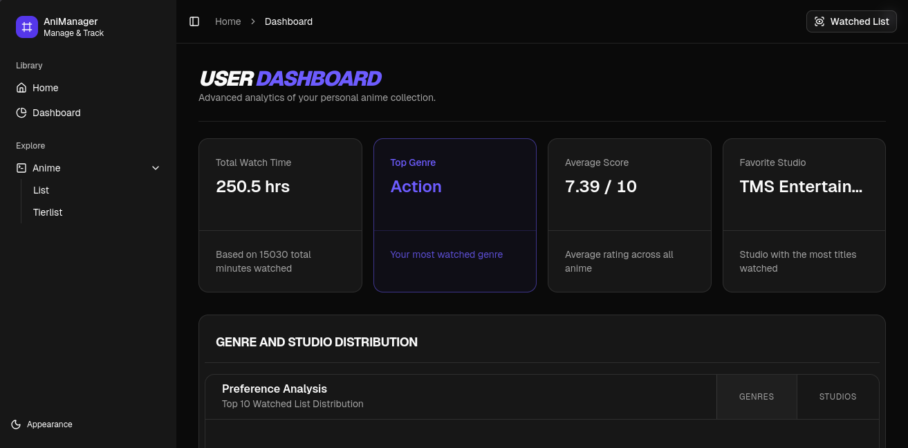
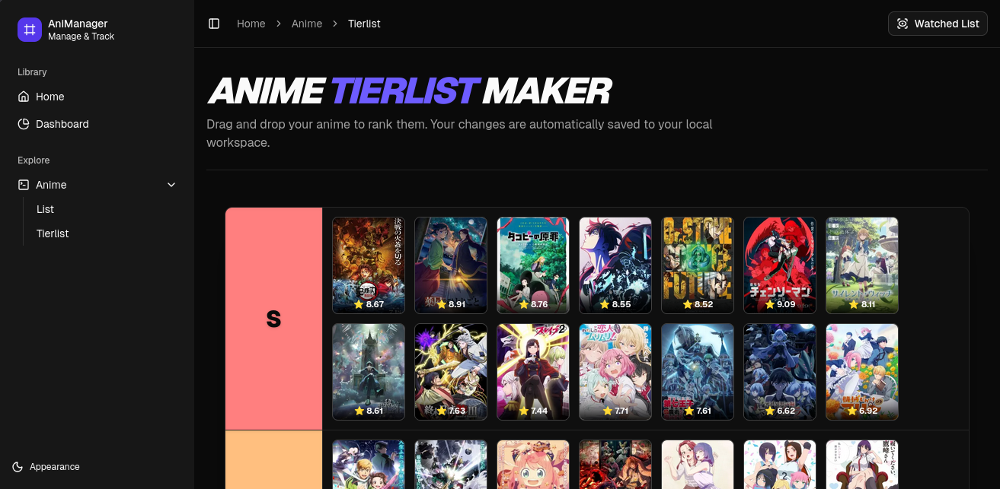
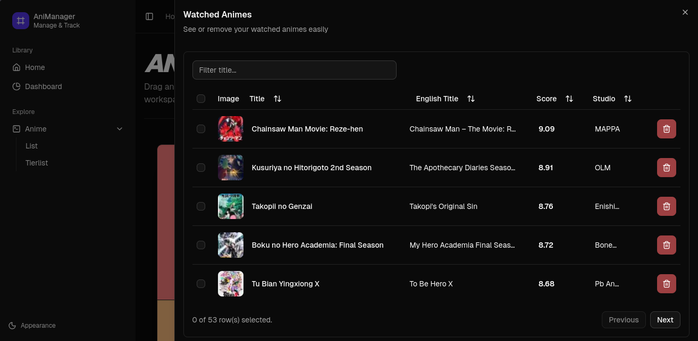

# 🏯 AniManager

**AniManager** es una plataforma integral para entusiastas del anime que permite buscar, gestionar listas de seguimiento, visualizar estadísticas personalizadas y crear tierlists interactivas. Construida con un enfoque en **User Experience (UX)** y una arquitectura escalable basada en módulos.


## 🚀 Características Principales

### 🏠 Home & Discovery
* **Hero Section Dinámica:** Interfaz inmersiva con fondos rotados y desplazados mediante overlays de degradado.
* **Bento Grid:** Exposición de funcionalidades principales mediante *Tilt Cards* con efectos de perspectiva 3D y animaciones de entrada fluidas (Motion).




### 🔍 Anime Explorer
* **Filtrado Avanzado:** Sistema de búsqueda basado en **React Hook Form (RHF)** con persistencia de estado en **Zustand**. Si el usuario navega fuera y regresa, recupera su última búsqueda.
* **Búsqueda Inteligente:** Integración con **TanStack Query** para fetching asíncrono, manejo de caché y query params sincronizados con la URL.
* **UI Adaptativa:** Los filtros se presentan en un `Modal` para escritorio y un `Drawer` para dispositivos móviles.


### 📊 Dashboard de Métricas
* **Estadísticas en Tiempo Real:** Visualización de tiempo total de visionado, géneros predominantes, puntuación media y estudios favoritos.
* **Gráficas Interactivas:** Top 10 de géneros y estudios utilizando **Recharts**.
* **Data Table Pro:** Tabla responsive completa con capacidades de ordenamiento, filtrado por múltiples atributos y acciones de borrado.


### 🏆 Tierlist Interactiva
* **Drag & Drop:** Sistema de ranking (S, A, B, C, D) implementado con **@dnd-kit**.
* **Sincronización:** Los animes de tu *Watched List* están disponibles inmediatamente para ser rankeados.


### 📱 Layout & UX
* **Sidebar & Header:** Navegación fluida con Breadcrumbs funcionales.
* **Watched List Sheet:** Acceso rápido lateral a la lista de seguimiento con una tabla optimizada:
    * *Mobile:* Vista simplificada con Tabs para cambiar entre campos.
    * *Desktop:* Vista tabular completa.


---

## 🛠️ Stack Tecnológico

| Categoría | Tecnologías |
| :--- | :--- |
| **Core** | React 19, Vite, TypeScript, Bun |
| **Estado & Data** | Zustand, TanStack Query v5, Axios |
| **Styling** | Tailwind CSS v4, Motion (Framer), Shadcn/UI |
| **Formularios** | React Hook Form, Zod (Validación) |
| **Routing** | React Router 7 |
| **Componentes UI** | Radix UI, Lucide React, Recharts |
| **API** | [Jikan API](https://jikan.moe/) (Unofficial MyAnimeList API) |

---

## 🏗️ Arquitectura del Proyecto

El proyecto sigue una estructura **Feature-Based**, lo que facilita el mantenimiento y la escalabilidad:

```text
src/
├── components/     # Componentes UI globales (Shadcn) y contextos
├── features/       # Módulos encapsulados (anime, dashboard, home, tierlist)
│   ├── components/ # Componentes específicos de la funcionalidad
│   ├── hooks/      # Hooks de lógica.
│   ├── services/   # Adaptadores de API y lógica de procesamiento
│   └── types/      # Definiciones de TypeScript locales
├── hooks/          # Hooks globales (useApi, use-mobile)
├── layouts/        # Estructuras de página (AppLayout)
├── stores/         # Estados globales con Zustand (watched, tierlist)
└── lib/            # Configuraciones de Axios y utilidades
```

---

## 🔧 Instalación y Configuración

Para ejecutar este proyecto localmente, asegúrate de tener [Bun](https://bun.sh/) instalado.

1.  **Clonar el repositorio:**
    ```bash
    git clone https://github.com/tu-usuario/animanager.git
    cd animanager
    ```

2.  **Instalar dependencias:**
    ```bash
    bun install
    ```

3.  **Ejecutar en modo desarrollo:**
    ```bash
    bun dev
    ```

4.  **Construir para producción:**
    ```bash
    bun run build
    ```

---

## 💡 Detalles Técnicos Relevantes

* **Optimización de Renderizado:** Se eliminó el uso de Web Workers para el borrado de la lista para evitar *flickering* en la UI, optando por una actualización síncrona del estado en Zustand para una respuesta inmediata.
* **Persistencia:** Uso de `persist` middleware en Zustand para mantener la configuración del usuario y su lista de anime en el `localStorage`.
* **Responsive Design:** Implementación de tablas dinámicas que cambian su representación de datos según el *viewport* del dispositivo.